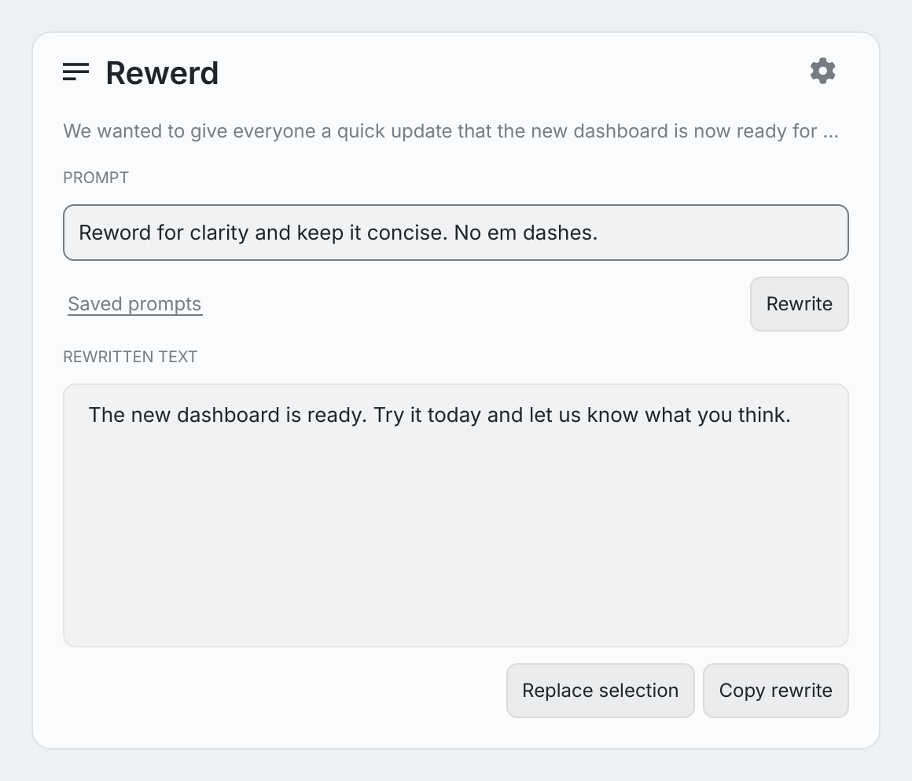

# Rewerd for Omarchy

Rewrite selected text in the Omarchy bar, review the result, then replace the selection or copy the rewrite. Bring your own OpenAI, Claude, or Google Gemini API key. Cursor is optional and uses the Cursor Agent CLI with a key or its existing login.



Preview rendered from the panel with sample text.

## Install

Requires Omarchy 4 with the Quattro plugin host, Hyprland 0.56 Lua dispatchers, Python 3, and `wl-copy` and `wl-paste` from `wl-clipboard`. Direct API providers need no Python packages. Cursor additionally requires `cursor-agent` with ask mode and sandbox support. Provider usage may incur charges under your account.

```sh
omarchy plugin add https://github.com/johnloringpollard/rewerd.git --enable
```

Omarchy installs the plugin under `~/.config/omarchy/plugins/io.github.johnloringpollard.rewerd`. Rewerd has no custom installer and does not edit your Hyprland bindings.

## Set up a provider

1. Click **Rewerd** in the bar, then the gear icon.
2. Choose your provider and model. Use **Get your provider API key** to open the provider's key page.
3. Enter your API key and click **Save settings**. For Cursor, you can instead authenticate with `cursor-agent login`.

Leave the key field blank to keep a saved key. Use **Remove key** to delete it. Available models depend on your provider account. See the model references for [OpenAI](https://developers.openai.com/api/docs/models), [Claude](https://platform.claude.com/docs/en/about-claude/models/overview), [Gemini](https://ai.google.dev/gemini-api/docs/models), and [Cursor CLI](https://cursor.com/docs/cli/overview).

## Rewrite text

1. Select text in an application and click **Rewerd**. Rewerd captures the selection before the panel takes focus. If there is no selection, it uses plain text from your clipboard.
2. Edit the prompt or choose one from **Saved prompts**.
3. Click **Rewrite** and review the result.
4. Click **Replace selection** to paste into the original application, or **Copy rewrite** to paste it yourself.

Press **Escape** or click outside the panel to dismiss it. Click the source preview to expand or collapse it. A long expanded preview can scroll.

With the prompt focused, press **Enter** to rewrite. After the result arrives, press **Enter** again to replace the selection and close. For clipboard input, the second press copies the result and closes. Editing the prompt makes the next **Enter** generate a new rewrite.

Each opening captures fresh input and clears the previous result. Your latest prompt stays in the field. Reopening or cancelling discards a pending response, but a request already sent may still finish and incur usage.

After a rewrite finishes, click **Add** beside **Saved prompts** to save the prompt. **Add** appears only when the field matches the prompt used for the latest rewrite. **Remove** deletes a saved prompt without changing the field.

## Add an optional shortcut

Check existing bindings with `omarchy menu keybindings --print`. If **Super+Alt+E** is free, add this line yourself to `~/.config/hypr/bindings.lua`:

```lua
o.bind("SUPER + ALT + E", "Rewerd", "omarchy-shell shell summon io.github.johnloringpollard.rewerd '{}'")
```

Select text before using the shortcut. Choose another key combination if that binding is already in use.

## Settings and privacy

Rewerd stores provider settings and keys in `~/.config/rewerd/settings.json`. Saved prompts and the latest draft live in `~/.config/rewerd/instructions.json`. The directory has mode `0700`, and these files have mode `0600`. Keys are masked in the panel and omitted from public status responses. These files are not encrypted.

Clicking **Rewrite** sends your source text and prompt to the selected provider. Rewerd does not save a source-text or response history. Your prompts are saved locally. Clipboard managers and providers may retain their own records.

Cursor runs in ask mode in a temporary workspace with sandboxing enabled and restrictive workspace permissions. It also loads its user-level configuration and may keep CLI session records. Omarchy plugins themselves run unsandboxed with your user account's access.

Rewerd uses the clipboard to capture and replace text. Copying a rewrite changes the clipboard. Review sensitive selections before sending them to a provider.

## Replacement limits

Replacement requires an editable field with standard **Ctrl+C** and **Ctrl+V** support. Rewerd checks the source window and recaptures its selection before pasting. A changed selection stops replacement. Terminal replacement is disabled, and static page text cannot be edited. Edits are plain text and can lose rich formatting. Use the application's Undo command to reverse a replacement.

No automatic migration imports credentials from older development copies. Configure this release through its Settings panel.

## Update or remove

```sh
omarchy plugin update io.github.johnloringpollard.rewerd
omarchy plugin disable io.github.johnloringpollard.rewerd
omarchy plugin remove io.github.johnloringpollard.rewerd
```

Use the command for the action you need. Remove your optional shortcut manually. Plugin removal leaves your saved configuration intact. To delete the saved keys and prompts too:

```sh
rm -f ~/.config/rewerd/settings.json ~/.config/rewerd/instructions.json
```

## Check a source checkout

Python 3 and Node.js run the portable checks without provider requests:

```sh
python3 scripts/check.py
```

On Omarchy, also validate the manifest and QML against the installed shell:

```sh
python3 scripts/check.py --omarchy
```

The Python tests check provider contracts, credential storage, and replacement guards with mocks. The Node tests exercise JavaScript extracted from the actual QML. These checks do not prove live provider access or desktop focus behavior. If PySide6 is installed, `python3 verify_preview.py` checks preview interaction offscreen. `python3 scripts/render_preview.py` recreates the preview from the panel with sample text and a neutral theme, without reading your clipboard or contacting a provider.

Build the runtime archive and its SHA-256 file with `python3 scripts/package.py`. See [PUBLISHING.md](PUBLISHING.md) for release and marketplace steps. Licensed under [MIT](LICENSE).
